# Let’s Go Shopping!

In this section we will review all the components used to build my 6 node (4 Raspberry Pi, 2 Intel ) k3s cluster.

My purchases are over 3 vendors to build the required part list. It's not in any particular order.

| [Amazon.com](https://amazon.com)                             |                                                              |                                                              |          |
| ------------------------------------------------------------ | ------------------------------------------------------------ | ------------------------------------------------------------ | -------- |
| Pic                                                          | Item                                                         | Link                                                         | Quantity |
| 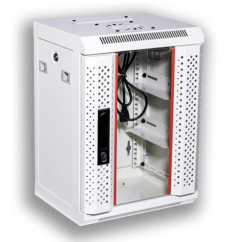 | KENUCO SOHO Mini 10’’ Rack for 10’’ Patch Panels, Shelves,  SOHO Active Components , Fan Not Included  NOT for 19” Rack (White-9U) | https://a.co/d/gQcgEcJ                                       | 1        |
| 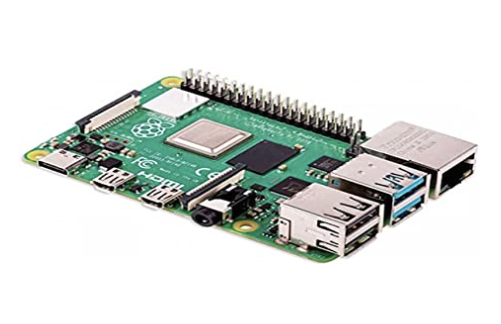 | Raspberry Pi 4 Computer Model B 8GB Single Board Computer  Suitable for Building Mini  PC/SmartRobot/Game Console/Workstation/Media Center/Etc. | https://a.co/d/78RnQnn                                       | 4        |
| 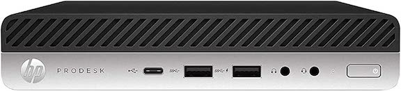 | HP ProDesk 600 G4 Mini, Intel Core i5-8500T 6-Core  up to 3.5GHz, 8GB RAM, 256GB M.2 PCIe NVMe SSD,  USB-C, Intel UHD Graphics 630 (Supports 4K),  Display Port, VGA, WiFi & BT, Windows 10 Pro (Renewed) | https://a.co/d/5iHP8Qa                                       | 2        |
| 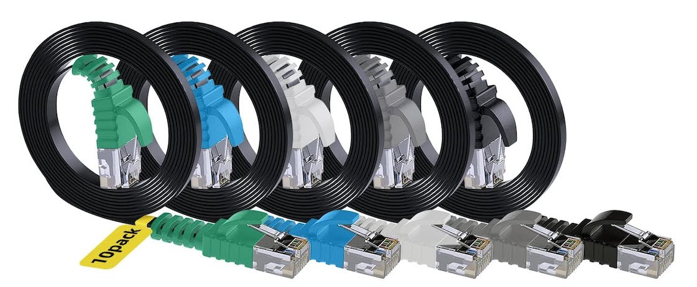 | Cat6 Flat Ethernet Cable 1 Feet/10 Pack,Adoreen High Speed Slim Patch  Cable(0.6ft to 50ft),Pure Copper Wire,10Gigabit 500MHz,Thin and  Flexible,Cat 6 Cat5e Cat5 Network Ether Cable with 15 Ties | https://a.co/d/dkTuW4M                                       | 1        |
| 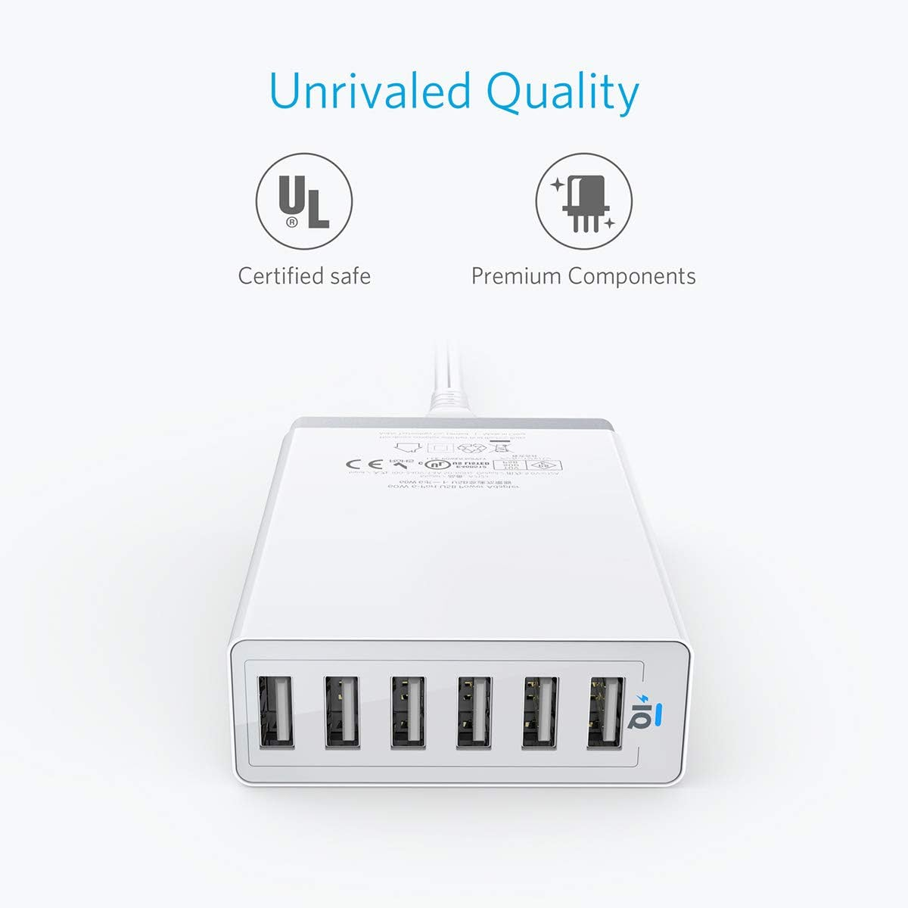 | Anker 60W 6-Port USB Wall Charger, PowerPort 6 for iPhone XS / XS Max / XR / X / 8 / 7 / 6 / Plus, iPad Pro / Air 2 / mini/ iPod, Galaxy S7 / S6 /  Edge / Plus, Note 5 / 4, LG, Nexus, HTC and More | https://a.co/d/18Y2V5a                                       | 1        |
| 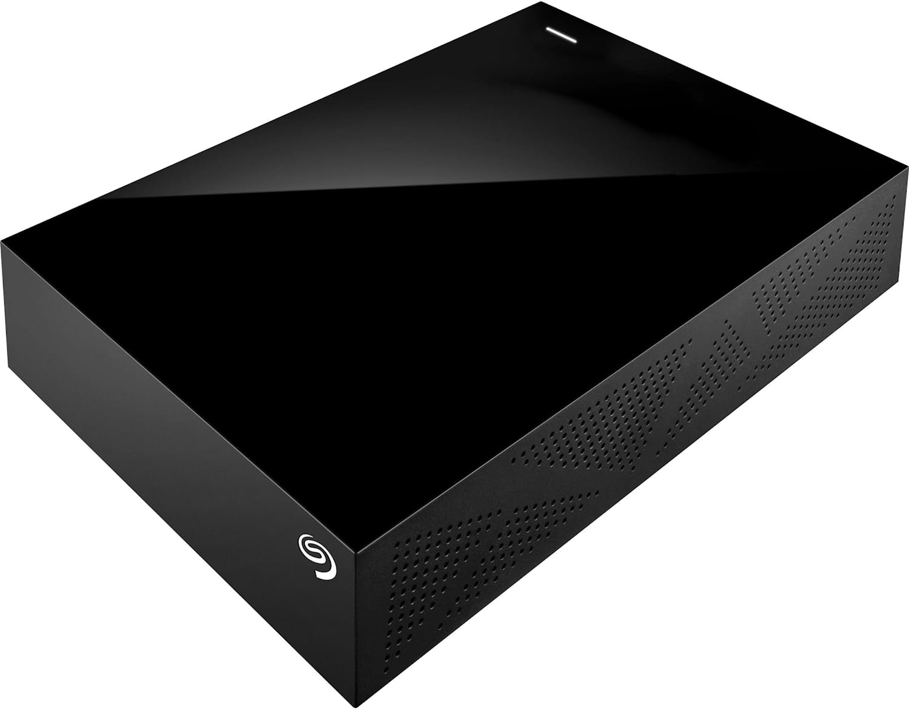 | Seagate Desktop 8TB External Hard Drive HDD – USB 3.0 for PC, Laptop And Mac, 1-Year Rescue Service (STGY8000400), Black | https://a.co/d/9NIrumD                                       | 3        |
| 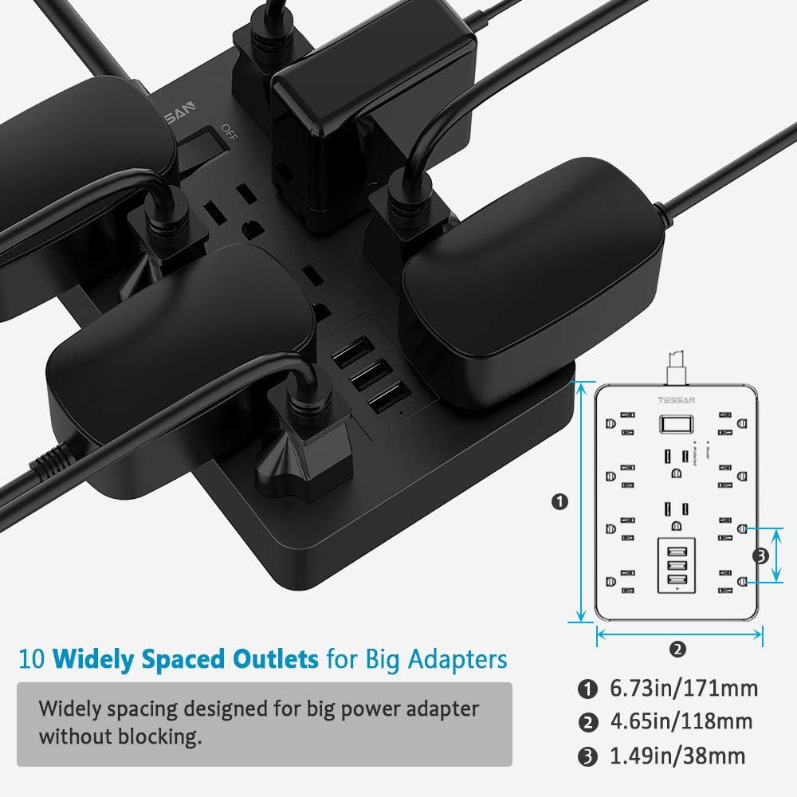 | Surge Protector with USB, TESSAN Power Strip Flat Plug with 10 Widely Spaced  AC Outlets and 3 Charging Ports, 1875W 15A 5FT, 1700 Joules, Wall Mount  Extension Cord for Home and Office, Black | https://a.co/d/fqc7dBQ                                       | 1        |
| 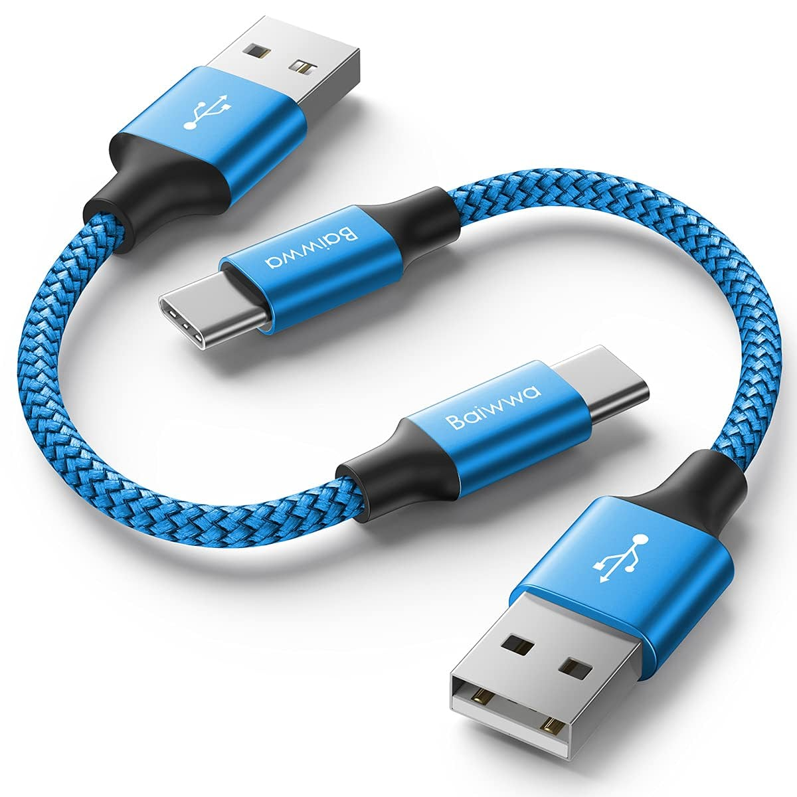 | Short USB C Cable [2-Pack, 1ft], Baiwwa 3A Fast Charging USB A to Type C Cord Braided Charger Compatible with Samsung Galaxy S22 S22+ S21 S21+ S21  Ultra S20 S10 S9 Plus Note 20 A72 A71 A52 A51 A20 A11 | https://a.co/d/aobPMFY                                       | 2        |
|  | [UL Listed] Miady Short Power Extension Cord Outlet Saver, 16AWG/13A, 3 Prong (4 Pack, Black, 8 Inch) | https://a.co/d/fde6vnR                                       | 1 or 2   |
|  | 3M Double Coated Urethane Foam Tape 4032 Double Sided Durable Adhesive (1in x 5yds) Attach, Bond, Mount | https://a.co/d/c02bY8F                                       | 1        |
| 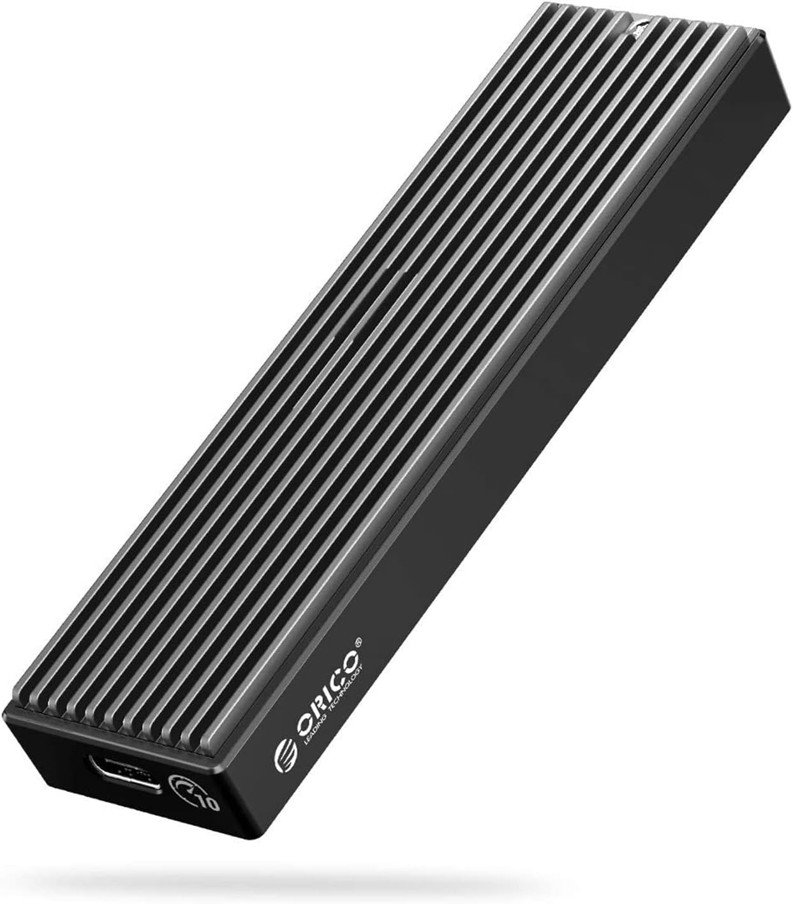 | ORICO M.2 NVMe SSD Enclosure, USB 3.1 Gen 2 (10 Gbps) to NVMe PCI-E M.2  SSD Case Support UASP for NVMe SSD Size 2230/2242/2260/2280(up to  4TB)-M2PV | https://a.co/d/60Adnes                                       | 4        |
|                         | Samsung 970 EVO Plus SSD 2TB NVMe M.2 Internal Solid State Hard Drive w/ V-NAND Technology, Storage and Memory Expansion for Gaming, Graphics w/ Heat... | https://a.co/d/be6F9F7                                       | 4        |
|                                                              |                                                              |                                                              |          |
| [Etsy.com](https://www.etsy.com)                             |                                                              |                                                              |          |
| 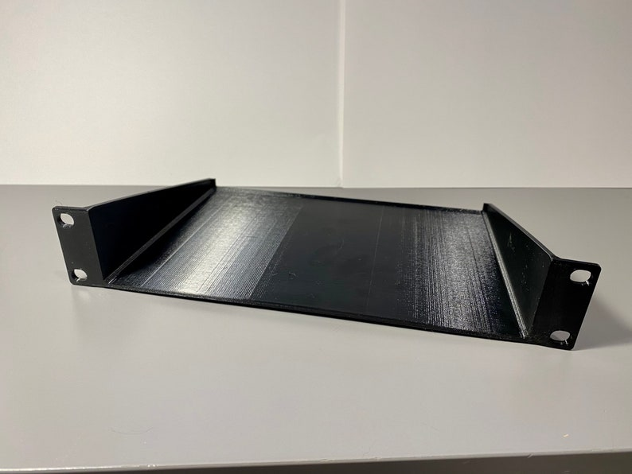 | Shelf for 10in Half Rack 1U                                  | https://www.etsy.com/listing/890877036/shelf-for-10in-half-rack-1u?transaction_id=3161480030 | 2        |
| 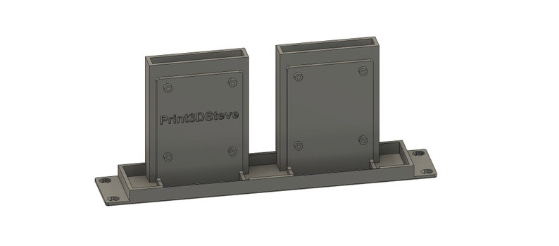 | Raspberry Pi with 2.5 Hard Drive 10in Half Rack 1U Mount     | https://www.etsy.com/listing/1075721021/raspberry-pi-with-25-hard-drive-10in?transaction_id=3137730371 | 2        |
| 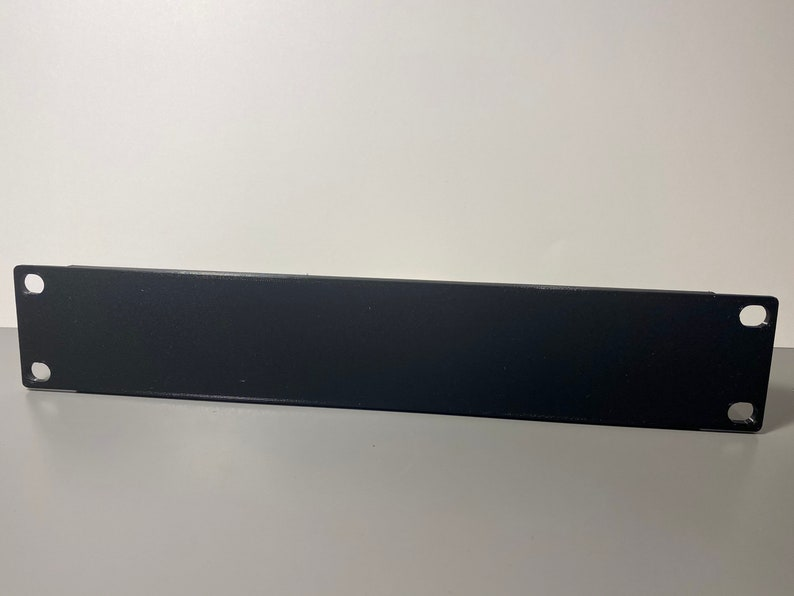 | Blank Plate 10in Half Rack 1U                                | https://www.etsy.com/listing/901667955/blank-plate-10in-half-rack-1u?transaction_id=3135654754 | 3        |
| 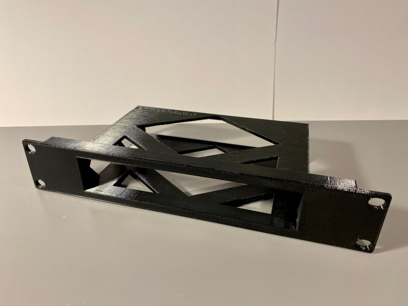 | NETGEAR GS108 Switch 10in Half Rack 1U Mount                 | https://www.etsy.com/listing/915445077/netgear-gs108-switch-10in-half-rack-1u?transaction_id=3135654758 | 2        |

