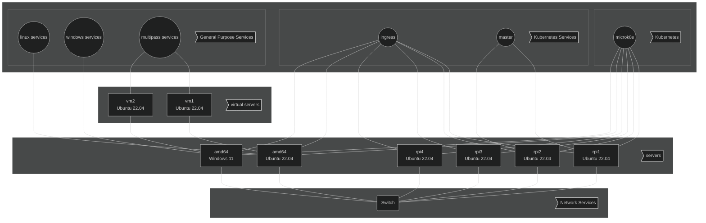

# Introduction

| Row 1, Column 1 | Row 1, Column 2 |
| --------------- | --------------- |
| Row 2, Column 1 | Row 2, Column 2 |

## Lab Architecture

```mermaid
%%{init: {"theme" : "dark", "width" : "100%"}}%%
flowchart TB
   subgraph ServerGroup[ ]
   direction LR
      rpi1
   	  rpi2
    	rpi3
    	rpi4
    	linux-lab
    	windows-lab
      Servers>servers]
   end  
   subgraph VirtualServerGroup[ ]
   direction LR
      vm1
   	  vm2
    	
      VMServers>virtual servers]
   end  
   subgraph ServiceGroup[ ]
   direction TB
      subgraph Kubernetes[ ]
    	direction RL
    	   a1((microk8s))---rpi1[rpi1<br>Ubuntu 22.04]
    	   a1---rpi2[rpi2<br>Ubuntu 22.04]
         a1---rpi3[rpi3<br>Ubuntu 22.04]
    	   a1---rpi4[rpi4<br>Ubuntu 22.04]
    	   a1---linux-lab[amd64<br>Ubuntu 22.04]
    	   a1---windows-lab[amd64<br>Windows 11]
    	   KB>Kubernetes]
      end    
      subgraph Kubernetes Services[ ]
    	direction RL
    	   a2((ingress))---rpi1
    	   a2---rpi2
    	   a2---rpi3
    	   a2---rpi4
    	   a2---linux-lab
    	   a2---windows-lab
    	   a3((master))---rpi1
    	   a3---rpi2
    	   KBServices>Kubernetes Services]
      end    
      subgraph General Purpose Services[ ]
      direction LR
    	   gp-linux((linux services))---linux-lab
    	   gp-windows((windows services))---windows-lab
    	   gp-multipass((multipass services))---vm1[vm1<br>Ubuntu 22.04]
    	   gp-multipass((multipass services))---vm2[vm2<br>Ubuntu 22.04]
    	   vm1---linux-lab
    	   vm2---windows-lab
         GPServices>General Purpose Services]
      end
   end
   subgraph NetworkServices[ ]
   direction LR  
     	rpi1[rpi1<br>Ubuntu 22.04]---n1(Switch)
    	rpi2[rpi2<br>Ubuntu 22.04]---n1
    	rpi3[rpi3<br>Ubuntu 22.04]---n1
    	rpi4[rpi4<br>Ubuntu 22.04]---n1
    	linux-lab[amd64<br>Ubuntu 22.04]---n1
    	windows-lab[amd64<br>Windows 11]---n1	   
    	Network>Network Services]
   end  
```

Test
