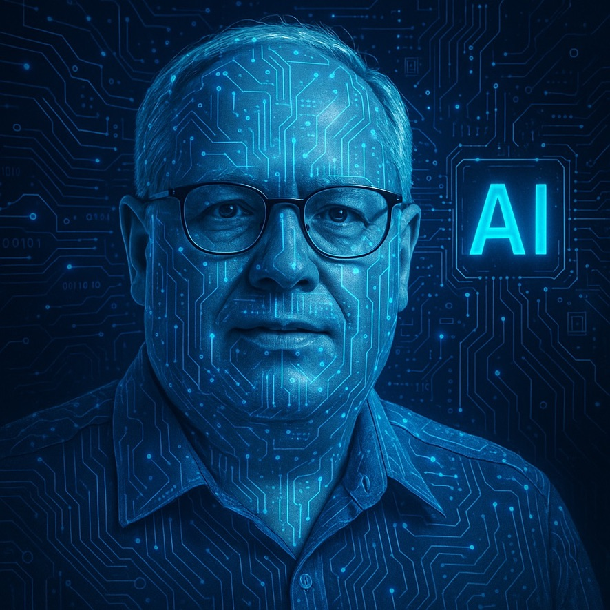

Last Tuesday, one of our developers used AI to write API documentation. He shaved off three hours of work — not by cutting corners, but by focusing on what actually matters....
<!--more-->

# AI-First at Work: How We’re Embedding AI into Everyday Operations in Our Data & Digital Teams  
*By Robert Liotta and AI*

## 🚀 This Isn’t a Thought Experiment — It’s Our Daily Reality

Last Tuesday, one of our developers used AI to write API documentation. He shaved off three hours of work — not by cutting corners, but by focusing on what actually matters.  
And he wasn’t an outlier.

At CEVA, moments like that happen every day. Not in a lab. Not on a roadmap. For us, **AI-first** isn’t a talking point — it’s how we work. A mindset we bring into meetings, projects, goal-setting, even how we reflect at the end of each week.

We didn’t start with a massive plan. We started with a single question — one we now ask every week:

> _“What did you rethink with AI this week?”_

That question is our quiet revolution. It challenges people to look at their day-to-day with fresh eyes. And that small shift? It changes everything.

## 🧠 Understanding AI: Let’s Get Real

If we’re going to live and breathe this, we need clarity.

Most of what we call AI today — the tools we actually use — fall under **“weak AI.”** That’s not an insult. It means these systems are built to handle specific tasks: summarizing documents, rewriting code, analyzing patterns. They don’t **think** — but they get results.

“Strong AI,” the stuff of movies and late-night debates, doesn’t exist yet. And honestly, we’re not worried about it. What we have today is enough to transform how we work — if we’re brave enough to use it.

AI is like a power tool in your hand. It doesn’t replace the craftsperson — it sharpens their edge.

### 🔧 Everyday Use Cases of Weak AI

| Category                    | Examples                                            | What AI Does                                                 |
|-----------------------------|-----------------------------------------------------|--------------------------------------------------------------|
| **Writing & Communication** | ChatGPT, Microsoft Copilot, MAIA                    | Drafts emails, rewrites documents, summarizes meetings       |
| **Meetings & Transcripts**  | Microsoft Teams & Copilot                           | Transcribes calls, extracts action items, summarizes discussions |
| **Project Management**      | Jira Assistants                                     | Suggests next steps, predicts deadlines, auto-updates tasks  |
| **Coding & DevOps**         | GitHub Copilot, Amazon CodeWhisperer, Google Gemini | Autocompletes code, flags bugs, suggests implementations     |
| **Data Analysis**           | Power BI Copilot, DataIKUI                          | Natural language data queries, AI-generated visuals          |
| **Security & IT Ops**       | CrowdStrike                                         | Threat detection, automated incident response                |
| **Personal Assistants**     | Siri, Google Assistant, Alexa for Business          | Schedules meetings, sets reminders, controls devices         |

### 🔁 What They All Have in Common

- **Focused intelligence** — Optimized for one task  
- **No real “understanding”** — Doesn’t reason like a human  
- **Human-in-the-loop** — Needs prompts, review, and validation  
- **Limited scope** — Can’t adapt outside their domain  

## 🔥 How We Made AI Part of Our Culture

What made this real for us wasn’t a memo. It was action — repeated, simple, human action.

I didn’t just endorse AI — I used it, and I shared examples in team meetings. **That made it safe for others to try.**  More importantly, we built a space where trying something new (and maybe failing) wasn’t just accepted — it was encouraged.

Every time someone said, “Hey, I used AI for this and it saved me an hour,” they shared it. That’s how culture shifts — not with banners, but with courage.

## 📍 Real Stories from Inside Our Team

These aren’t initiatives. They’re habits. This isn’t theory — it’s how we work.

### 🎓 Learning by Doing

CEVA sent me through Tangram AI training — not just slides and a certificate, but 12+ hours of pre-work and five intense days of hands-on labs. I came back energized, not just informed. Because when leaders feel it, they spread it.  **What you cannot see in the photo is the team was operating trucks, managing paperwork,  and moving containers from trucks to ships all with our hands!**

### 💻 Coding with a Second Brain

In development, AI became a co-pilot — helping us write code, document changes, and build smarter.  I mentioned an example at the beginning of this article.

### 🗂️ Rethinking Goals, Together

When it came time to write team goals, we didn’t start from scratch. We used large language models to draft, edit, and refine. The result was clear, collaborative, and aligned — not just approved.

### 🧠 AI in the Background — Quietly Powerful

In operations, AI became an invisible helper. It pulled insights from emails, created executive summaries, even opened ServiceNow tickets. Hours saved. Clarity gained.  Here’s and example prompt you can try:

*“Need a brilliant presentation about how to use ServiceNOW as not only a support tool but also a knowledgebase.  This should include cool meaningful pictures and artwork including an inspirational Video at the end!”*

### 💰 Smarter FinOps

We use AI to break down Kubernetes costs, assist with chargebacks, and guide teams toward better architecture. It’s like having a CFO and cloud engineer in your pocket — running 24/7.

### 🔬 Decision-Making on Another Level

When weighing canonical vs. unstructured data models, AI didn’t make the decision — but it surfaced the insights that mattered. It filtered articles, decks, and discussions — turning noise into clarity.

## ❗ The Truth: AI Isn’t Coming for Your Job

Let’s kill the fear-mongering. AI isn’t here to take your job — it’s here to take the junk work off your plate.

What’s really at stake? Your time. Your focus. Your ability to do your best thinking.

The real threat isn’t AI. It’s the person next to you who’s figured out how to use it — and now gets more done, with better insight and less stress.

Use it to:
- **Automate grunt work** — so you can focus on strategy  
- **Accelerate decision-making** — with faster, clearer inputs  
- **Amplify your strengths** — by offloading the robotic tasks  

**Start small. Pick one task this week to rethink with AI — and reclaim your edge.**

## 🎯 Final Thought: This Isn’t About Tools. It’s About Trust.

At CEVA, AI isn't future-facing — it’s already part of how we work. Every day. In real ways.

It’s not perfect. Neither are we. But when we use AI consistently, we’re not just saving time — we’re creating space to think, lead, and connect.

This isn’t humans vs. AI. It’s **humans with AI** — thinking bigger, working better, growing faster.

## 👋 Want to Start?

> In your next team meeting, try asking: ***'What did you rethink with AI this week?'*** It won’t just change the conversation — it might change your culture.

