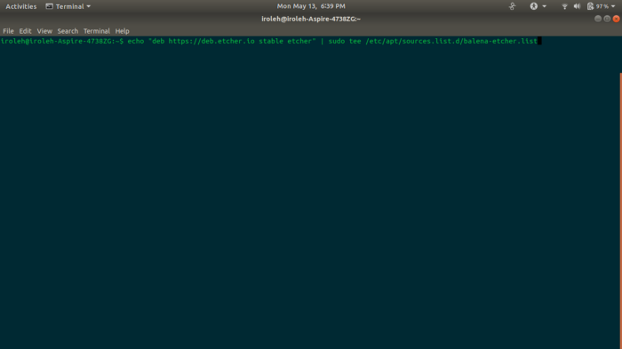
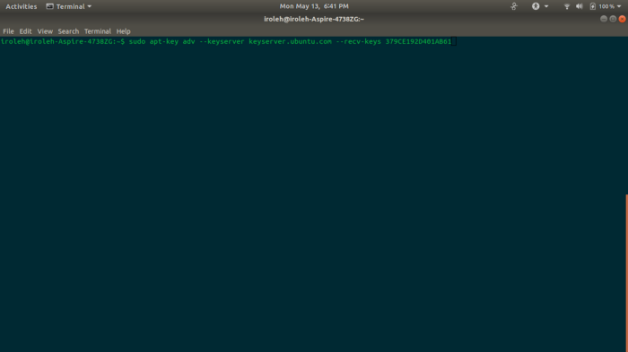
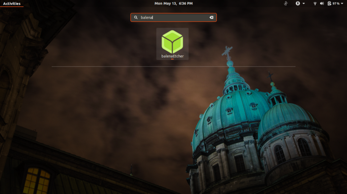
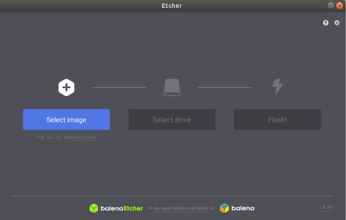
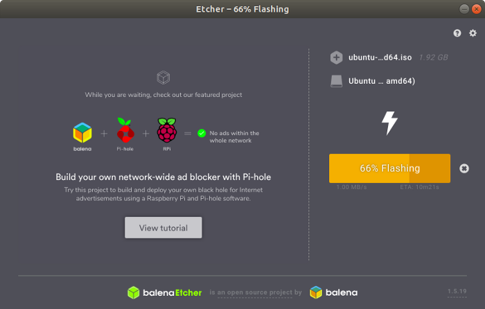
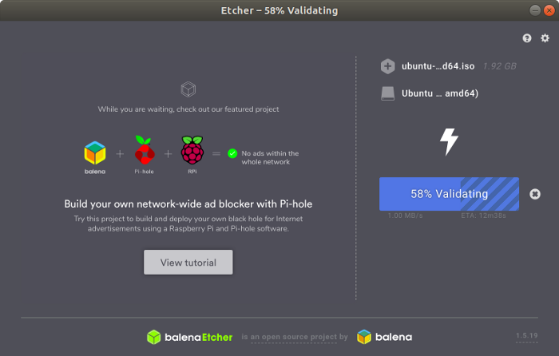
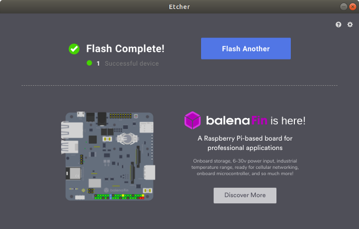

Coming from Windows, RUFUS application has been the hot chick in town when it  comes to creating a bootable USB. But RUFUS only supports Windows and  Mac.

So if you are using Linux distributions, RUFUS is not the way to go. But  fear not. Just as the case with almost every other tasks, popular Linux  distros such as Ubuntu has never failed to meet the user demands. Same  is the situation when you need to convert ISO to bootable USB Media in  Ubuntu, Linux Mint, or any Debian distros.

In this tutorial, I’m going to show you how to create a bootable USB Media in Ubuntu within a minute. So I assume you already have Ubuntu running  on your PC.

For this tutorial, I will be making an Ubuntu ISO 18.04 bootable in a USB 4GB flash drive.

**STEP 1: Downloading** [**Balena Etcher**](https://www.balena.io/etcher/) **Desktop App**

Open the terminal… ***Ctrl+Alt+T\***

- Add Etcher debian repository: 
  ***Press the Enter keyboard after every command.\***



```
echo "deb https://deb.etcher.io stable etcher" | sudo tee /etc/apt/sources.list.d/balena-etcher.list
```

- Trust Bintray.com’s GPG key:



```
sudo apt-key adv --keyserver keyserver.ubuntu.com --recv-keys 379CE192D401AB61
```

- Update and install:

```
sudo apt-get updatesudo apt-get install balena-etcher-electron
```

**Ever feel like uninstalling it?**
Uninstall:

```
sudo apt-get remove balena-etcher-electronsudo rm /etc/apt/sources.list.d/balena-etcher.listsudo apt-get update
```

**STEP 2: Open BalenaEtcher**

Search BalenaEtcher from your Application Menu, or simply press the windows key and type ‘BalenaEtcher’.



Search for BalenaEtcher on ubuntu 18.04

**STEP 3: The Final Step (Making the USB Bootable)**



balenaEtcher environment

The environment is simple and straight forward:

- Select the image (iso file)
- Select the flash drive plugged in the PC
- Click on the Flash button, wait for the magic to happen

**Grab a cup of coffee, while the magic happens…**



flashing



validating

**Boom!!! Magic Done. 
Your USB flash drive is bootable, unmount your drive, and go make yourself proud…**



Flash complete

```
sudo umount /dev/sdc1
```

Original Article: https://medium.com/studevs/create-bootable-usb-media-in-ubuntu-using-balenaetcher-53f4b4010111
