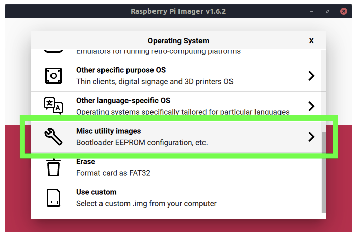
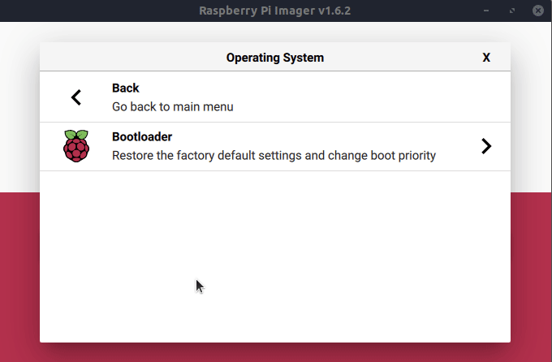
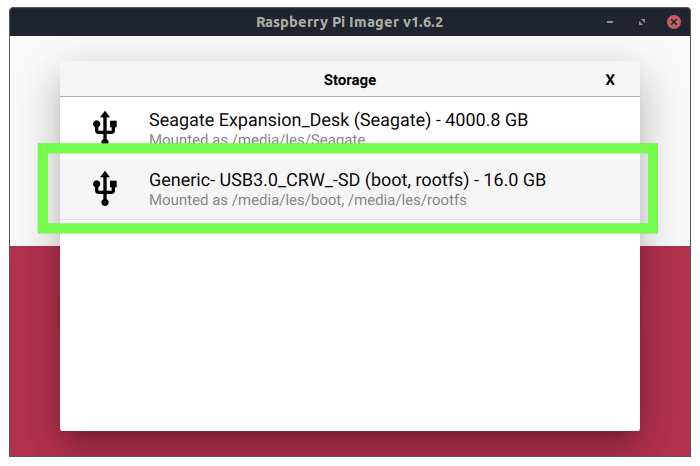

# Firmware Upgrade

***Editor's Note (7/24/2021):*** _We have updated this tutorial to include how you can boot your_ ***Raspberry Pi 400*** _from USB._

By default, [Raspberry Pi](https://www.tomshardware.com/news/raspberry-pi) boots up and stores all of its programs on a microSD memory card, which has a maximum theoretical bandwidth of 50 MBps on the [Raspberry Pi 4](https://www.tomshardware.com/reviews/raspberry-pi-4) and just 25 MBps on prior models. In real-life, even the [best microSD cards for Raspberry Pi](https://www.tomshardware.com/best-picks/raspberry-pi-microsd-cards) get no faster than about 38 MBps in sequential writes.  Using an external SSD as your main storage drive could speed things up significantly and, with a few commands and a simple firmware update, you can do just that.

In our real-life [tests of a Raspberry Pi 4 with SSD](https://www.tomshardware.com/news/raspberry-pi-4-ssd-test,39811.html) last year we got impressive performance with sequential transfer rates as high as 140 MB / 208 MBps for reading and writing. You can also use a standard USB flash drive, though we found the performance worse than a microSD card on many tasks.

## How to Boot Raspberry Pi 4 / 400 from USB

If you want to start with a fresh install of Raspberry Pi OS, simply follow the instructions in our tutorial on [how to set up Raspberry Pi](https://www.tomshardware.com/reviews/raspberry-pi-set-up-how-to,6029.html) or how to do a Raspberry Pi headless install.

The latest versions of Raspberry Pi OS (as of April 29 2021 or later) have many of the necessary changes built-in. The Raspberry Pi Imager now has a much simpler means to prepare a Raspberry Pi 4 / 400 for USB boot. These instructions will set the Raspberry Pi 4 / 400 to look for a USB boot device, if none is found it will then boot from the micro SD card.

1\. [**Download and install Raspberry Pi Imager**](https://www.raspberrypi.org/downloads/) **from the Raspberry Pi website.**

2\. **Insert a spare micro SD card into your computer.** Note that this card will be erased.

3\. **Launch Raspberry Pi Imager and under Operating System scroll down to Misc Utility Images and left click to open the next menu.**

(Image credit: Tom's Hardware)

4\. **Select Bootloader and then Select USB Boot.** This will return us to the main menu.

(Image credit: Tom’s Hardware)

5\. **Under Storage click on the button and select the micro SD card.** Double check that you have the right drive before proceeding.

(Image credit: Tom's Hardware)

6\. **Click on Write** to download and write a configuration image to the micro SD card. When done remove the card from your computer.

(Image credit: Tom's Hardware)

7\. **Insert the micro SD card into your Raspberry Pi 4 / 400 and power on.** The green activity light will blink a steady pattern once the update has been completed. If you have an HDMI monitor attached, the screen will go green once the update is complete. Allow 10 seconds or more for the update to complete, do not remove the micro SD card until the update is complete.

8\. **Power off the Raspberry Pi and remove the micro SD card.**

Keep in mind that, if you are using an external drive that saps a lot of power from the bus, you may have issues (which you could probably solve by using a drive that has its own power source or by using a powered USB hub).

For example, we had problems using a bus-powered, external Kingston HyperX SSD, which booted but -- perhaps because of how much power it was using -- none of our peripherals would work. A SATA SSD in a externally powered dock worked fine as did a USB Flash drive.

