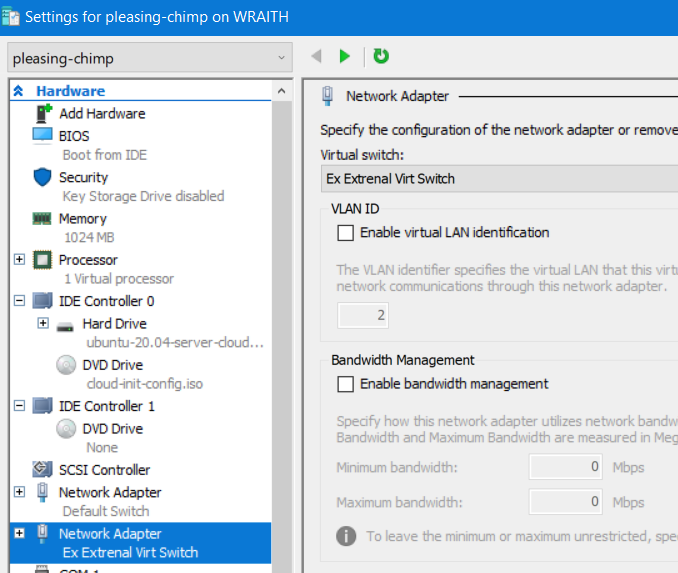

On a default install my primary and subsequent guests get IP addresses of the format `172.18.91.119/28 brd 172.18.91.127`

The docs are not clear as to what is acting as a DHCP server, but I  see DHCP happening in the guest logs, so I will chalk it up to some  Multipass magic.

The problem I was confronted with is that I could not ssh into these  guests from elsewhere on the ipv4 network. Only from WSL on my Host  machine. Now it’s possible that this is some windows firewall setting on my part. But I also think it’s possible that Multipass is setting up a  bridge network without ingress. 

**To enable network access to your guest vms:**

–Create a Virtual Switch on your network interface

- Open hyper-v manager.
- Action > Virtual Switch Manager
- Select External > Create Virtual Switch
  - Give the virtual switch a name
  - Select the Network Interface you want the switch to attach to and apply.


[ 


[image.png881×586 106 KB ](https://ubuntucommunity.s3.dualstack.us-east-2.amazonaws.com/original/2X/2/2939d32587d65d4e7dd9246505090a183d341397.png)


 Attach


–Attach Guest to Virtual Switch

- With the guest powered off
- Right click on the Virtual Machine name that you want to access, and go to Settings.
- Select Add Hardware, Network Adapter.
- Navigate to the new Network Adapter and select the new Virtual Switch you added in the previous step.
   

–Make your guest aware of the new interface

- Open a shell to your guest, via Multipass
- `ip link` should show a new interface, probably `eth1`
- Make a backup of `/etc/netplan/NN-cloud-init.yaml`
- Observing proper YAML spacing, add the lines:

```
        eth1:
            dhcp4: true
```

So your `/etc/netplan/NN-cloud-init.yaml` should look approximately like:

```
network:
    ethernets:
        eth0:
            dhcp4: true
            match:
                macaddress: 00:15:5d:3d:39:02
            set-name: eth0
        eth1:
            dhcp4: true
    version: 2
```

- Run `sudo netplan generate`, you will be prompted if there are yaml errors.
- Run `sudo netplan apply` You may lose connection during this point.
- You may need to do a `systemctl restart systemd-networkd.service` or restart the guest via Multipass.
- If everything went well `ip addr` should show that you’ve leased an IP address.
- The guests disallow password logins, so copy your public ssh key to `~authorized_keys` on the guest, to enable logging in.

I hope someone finds this helpful 

Original Article: https://discourse.ubuntu.com/t/solution-multipass-not-reachable-from-outside-windows-10-networking-host/16392


